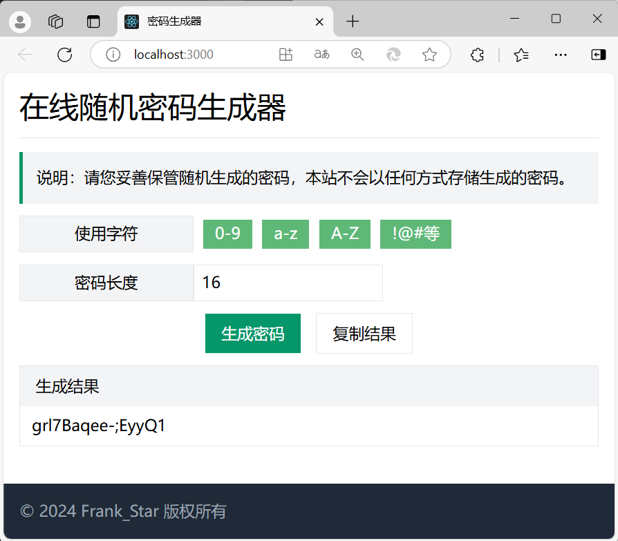

# Password Generator

一个基于前端的简易的密码生成器。\
技术栈：React + Tailwind CSS

### 运行截屏
<div align=center>
    
</div>

<!--  -->
<!-- <style type="text/css">
  .aligncenter {
    clear: both;
    display: block;
    margin: auto;
  }
</style> -->

### 启动项目
```
npm start
```
在浏览器中打开 [http://localhost:3000](http://localhost:3000) 查看。

### 启动 Tailwind CLI 
```
npx tailwindcss -i ./src/index.css -o ./src/index_output.css --watch
```


